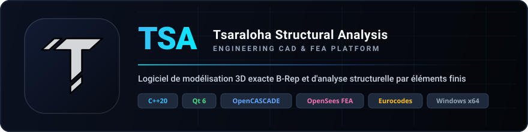

<p align="center">
  
</p>

<p align="center">
  
</p>

<h1 align="center">TSALab — Tsaraloha Structural Analysis Laboratory</h1>

<p align="center">
  <strong>Laboratoire virtuel de modélisation CAO 3D B-Rep exacte, d'analyse structurelle multi-moteurs (FEA / RDM), d'interopérabilité openBIM (IFC 4.3) et de co-ingénierie assistée par IA pour le génie civil.</strong><br>
  Développé en <b>C++20</b> avec <b>Qt 6</b>, le noyau géométrique <b>OpenCASCADE (OCCT 8.0.1)</b>, le moteur de calcul <b>OpenSees</b> et le moteur analytique <b>MetDeDeplacement (Custom2D)</b>.
</p>

<p align="center">
  <a href="https://en.cppreference.com/w/cpp/20"></a>
  <a href="https://www.qt.io/"></a>
  <a href="https://dev.opencascade.org/"></a>
  <a href="https://opensees.berkeley.edu/"></a>
  <a href="docs/BIM_ARCHITECTURE.md"></a>
  <a href="docs/AI_COENGINEERING.md"></a>
  <a href="https://www.microsoft.com/windows"></a>
  <a href="https://cmake.org"></a>
  <a href="tests/"></a>
  <a href="docs/NORMATIVE_SYSTEM.md"></a>
</p>

<p align="center">
  <a href="#-présentation">Présentation</a> •
  <a href="#-getting-started--démarrage-rapide">Démarrage Rapide</a> •
  <a href="#-optimisation-du-pipeline-de-build">Build & Pipeline</a> •
  <a href="#-architecture-logicielle--source-de-vérité">Architecture</a> •
  <a href="#-fonctionnalités-majeures">Fonctionnalités</a> •
  <a href="#-ruban-principal--ergonomie-cao">Interface</a> •
  <a href="#-tests-automatisés">Tests (212)</a> •
  <a href="#-système-dextensions-tsalib">TSALib</a> •
  <a href="#-organisation-du-dépôt">Organisation</a> •
  <a href="#-documentation-technique">Documentation</a>
</p>

---

## 📖 Présentation

**TSALab (Tsaraloha Structural Analysis Laboratory)** est un laboratoire virtuel et une suite logicielle desktop d'ingénierie des structures de nouvelle génération. Issu et propulsé par la base technologique de TSA, TSALab repousse les frontières de l'analyse structurelle en combinant la modélisation CAO volumique exacte (**OpenCASCADE Technology**), une architecture d'analyse multi-moteurs (**OpenSees 3.8.0** et le solveur de RDM plane **MetDeDeplacement** en C++20), l'interopérabilité native **openBIM (IFC 4.3)**, un assistant de **co-ingénierie par IA locale**, ainsi qu'une interface utilisateur réactive (**Qt 6**) orchestrée par la fenêtre moderne **AppShell** (Start Center et espace de travail à la demande).

TSALab permet de modéliser, vérifier, charger, analyser et inspecter en 3D interactive des bâtiments à étages, des halles industrielles, des fermes et treillis spatiaux, des structures haubanées et des systèmes de fondations selon les normes européennes (**Eurocodes**).

---

## 🚀 Getting Started / Démarrage Rapide

### Prérequis Système & Environnement
* **Système d'exploitation :** Windows 10 / 11 (64-bit)
* **Compilateur :** MSVC (Visual Studio 2022 ou 2026 x64) avec support complet C++20 *(recommandé)* ou MinGW-w64 (GCC 13+)
* **CMake :** Version 3.20+
* **Ninja :** Intégré à Visual Studio (composant *Outils CMake pour Windows*) ou via `winget install Ninja-build.Ninja`
* **Qt 6 :** Version 6.2+ (`Core`, `Gui`, `Widgets`, `Svg`, `Network`) — ex. `C:\Qt\6.11.2\msvc2022_64`
* **OpenCASCADE 8.0.1 & Dépendances 3rdparty :** Téléchargées et extraites automatiquement par CMake si absentes de la machine.

---

### <ins>1. Téléchargement du Dépôt</ins>

Clonez le projet avec Git :

```powershell
git clone https://github.com/ChristinotLeonnel/Tsaraloha-Structural-Analysis-Virtual-Laboratory.git TSALab
cd TSALab
```

---

### <ins>2. Configuration Automatique des Dépendances</ins>

Le projet intègre un orchestrateur intelligent en PowerShell (`scripts/setup_build.ps1`) qui inspecte votre environnement, configure les toolchains, télécharge les SDKs nécessaires et prépare CMake sans aucune action manuelle complexe :

```powershell
# Détection automatique de la toolchain et configuration du build
powershell -ExecutionPolicy Bypass -File .\scripts\setup_build.ps1
```

---

### <ins>3. Compilation du Projet</ins>

#### Option A : Ninja Presets *(Recommandé pour le développement quotidien)*
Ninja offre la vitesse de compilation maximale grâce à la compilation parallèle et aux en-têtes précompilés (PCH) :

```powershell
# 1. Charger l'environnement MSVC dans le terminal courant (une seule fois par session PowerShell)
Set-ExecutionPolicy -Scope Process -ExecutionPolicy Bypass -Force
$vs = & "${env:ProgramFiles(x86)}\Microsoft Visual Studio\Installer\vswhere.exe" -latest -property installationPath
& "$vs\Common7\Tools\Launch-VsDevShell.ps1" -Arch amd64 -HostArch amd64

# 2. Configuration & compilation Debug
cmake --preset ninja-debug
cmake --build --preset ninja-debug -- -k 0

# Ou compilation Release
cmake --preset ninja-release
cmake --build --preset ninja-release
```

#### Option B : Visual Studio Presets
```powershell
# Configuration & compilation Release
cmake --preset windows-x64-release
cmake --build --preset windows-x64-release
```

#### Option C : Script Tout-en-Un
```powershell
# Configure et compile automatiquement en mode Release
powershell -ExecutionPolicy Bypass -File .\scripts\setup_build.ps1 -Build
```

---

### <ins>4. Lancement de TSALab</ins>

Utilisez le script automatique à la racine du projet :

```cmd
run.bat
```

> **Note :** `run.bat` initialise les variables d'environnement OpenCASCADE (`CSF_OCCTResourcePath`, `CSF_OCCTShadersPath`), injecte les bibliothèques dynamiques Qt et tierces dans le `PATH`, et démarre automatiquement le binaire le plus récent (`build-ninja-debug`, `build-ninja-release` ou `build/Release`). Pour cibler un dossier spécifique :
> ```cmd
> run.bat build-ninja-debug
> ```

Au premier lancement, la fenêtre principale **AppShell** s'affiche instantanément (< 1 s) sur le **Start Center** (galerie des projets récents avec aperçus 3D réels, création rapide, import). L'espace de travail complet (`MainWindow`) est ensuite instancié à la demande lors de l'ouverture ou de la création d'un projet.

---

## ⚡ Optimisation du Pipeline de Build

Le temps de compilation de TSALab est optimisé pour les développeurs C++ exigeants :

* **Bibliothèque `TSALab_Core` (OBJECT) :** Tout le code métier (modèle structural, calculs multi-moteurs, couche BIM, IA, commandes, grilles, I/O, extensions) est compilé **une seule et unique fois**, puis lié directement à l'exécutable principal `TSALab` et à la suite de tests `TSALab_Tests`.
* **En-têtes Précompilés (PCH) Partagés :** Les en-têtes volumineux stables (Qt Widgets/Core, OpenCASCADE `gp_*`/`TopoDS_Shape`, STL C++20) sont précompilés et partagés entre toutes les cibles.
* **Includes OpenCASCADE en `SYSTEM` :** Élimine le coût d'analyse des avertissements issus des bibliothèques externes.
* **Extension Shell Autonome (`TSALabThumbnailProvider.dll`) :** Développée en C++/Win32 pur sans dépendance Qt ni OCCT, garantissant une exécution ultra-rapide et sécurisée au sein du processus de l'Explorateur Windows.

---

## 🏛️ Architecture Logicielle & Source de Vérité

TSALab applique un principe architectural strict : **le modèle structural (`TSA::Model::Model`) est la source de vérité unique**.

```text
               +-------------------------------------------------------------+
               |                  Fenêtre Hôte AppShell                      |
               |          TitleBar (DWM) | StartCenter | MainWindow          |
               +-------------------------------------------------------------+
                                              |
                                              | Signaux / Commandes réversibles
                                              v
               +-------------------------------------------------------------+
               |           Commands & Undo/Redo (ICommand, Manager)          |
               |             Model Snapshots & Transactions d'Édition        |
               +-------------------------------------------------------------+
                                              |
                                              v
   =========================================================================================
   ===               MODÈLE STRUCTURAL (TSA::Model::Model) — SOURCE DE VÉRITÉ            ===
   ===       Node, Beam, Column, Cable, Slab, Wall, Foundation, Section, Material        ===
   =========================================================================================
          /                           |                           |                    \
         /                            |                           |                     \
        v                             v                           v                      v
+----------------+            +----------------+          +----------------+     +---------------+
| Géométrie 3D   |            | Multi-Moteurs  |          | Couche openBIM |     | Co-Ingénierie |
| (*Geometry)    |            | AnalysisManager|          |   (BimModel)   |     |   IA Locale   |
+----------------+            +----------------+          +----------------+     +---------------+
        |                             |                           |                      |
        v                             v                           v                      v
+----------------+            +----------------+          +----------------+     +---------------+
| Viewer OCCT    |            | Solveurs:      |          | StepWriter     |     | llama-server  |
| AIS_Shape      |            | • OpenSees 3D  |          | IfcExporter    |     | RAG Modèle    |
| OccView, V3d   |            | • Custom2D MDD |          | IFC4X3_ADD2    |     | Hardware Diag |
+----------------+            +----------------+          +----------------+     +---------------+
                                      |
                                      v
                              +----------------+
                              | Résultats RDM  |
                              | & Note Calcul  |
                              +----------------+
```

* Aucun widget UI ne manipule directement la géométrie OpenCASCADE.
* Aucune forme OCCT (`TopoDS_Shape`) n'est utilisée pour stocker des données mécaniques.
* Les modifications d'état transitent obligatoirement par le système de commandes transactionnelles avec support complet Undo/Redo.
* La couche openBIM maintient un mapping biunivoque non-destructif (1:N) entre produits physiques et éléments analytiques.

---

## ✨ Fonctionnalités Majeures

### 1. 🏗️ Modélisation Structurale & Noyau CAO 3D B-Rep
* **Solides B-Rep Exacts (OpenCASCADE 8.0.1)** : Pas de facettisation polygonale approximative ; géométrie volumique exacte pour tous les profilés, nœuds et assemblages.
* **Éléments Filaires 1D** : Poutres, poteaux, barres spatiales génériques, câbles et haubans tendus avec prise en compte du comportement élastique non-linéaire.
* **Générateur Automatique de Treillis** : Création instantanée et paramétrique de fermes métalliques de types **Warren** (diagonales alternées), **Pratt** (diagonales tendues) et **Howe** (diagonales comprimées).
* **Éléments Surfaciques 2D** : Dalles et planchers (report de charge unidirectionnel ou bidirectionnel), voiles et murs porteurs banchés, semelles superficielles de fondation.
* **Plans de Travail 3D Interactifs (WorkPlanes)** : Définition par 3 points arbitraires ou alignement sur les niveaux d'étages ; projection bidirectionnelle non-destructive 2D $\leftrightarrow$ 3D et magnétisme intelligent.
* **Accrochage 3D en Espace Écran (OSNAP)** : Système d'accrochage haute précision avec priorités contextuelles (Nœud > Milieu > Intersection > Centre > Grille).
* **Conditions d'Appuis Spatiales (6 DDL)** : Encastrements complets, rotules/articulations, appuis simples (rouleaux), degrés de liberté découplés ($T_x, T_y, T_z, R_x, R_y, R_z$) représentés par des solides B-Rep paramétriques (plaques d'assise, cônes, cylindres).
* **Actions & Combinaisons Eurocodes** : Forces et moments nodaux, charges réparties uniformes et trapézoïdales, calcul automatique du poids propre volumique, cas de charges et combinaisons ELU / ELS.

### 2. 📐 Outils Avancés de Modélisation & Nettoyage Topologique
* **14 Outils de Modification 3D** : Déplacer, Copier, Rotation, Symétrie (plans X, Y, Z et quelconques), Échelle, Réseaux linéaires, Réseaux polaires, Décaler, Diviser en N tronçons, Diviser au point, Intersecter des barres, Prolonger, Ajuster, Fusionner des barres alignées.
* **6 Outils de Dessin Paramétrique** : Tracé en chaîne continue, Rectangle 3D, Portique plan paramétrique, Contreventement en X, Arc de cercle discrétisé, Génération de poteaux sur trame de grille.
* **Nettoyage Topologique Automatique (`ModelCleanup`)** :
  * Fusion automatique des nœuds confondus selon une tolérance paramétrable.
  * Détection et suppression des barres en doublon avec report automatique des charges associées.
  * Raccordement des nœuds intermédiaires situés sur des barres continues (division topologique).
  * Suppression des nœuds isolés sans éléments raccordés.
  * Audit de santé pré-calcul proposé automatiquement avant toute résolution numérique.
* **Édition Groupée Multi-Éléments** : Sélection multiple avec report contextuel des modifications géométriques et matérielles au sein de sessions d'édition sécurisées.
* **Système d'Isolation 3D Unifié** : Isoler la sélection, isoler par type de famille, isoler le plan de travail actif, masquer, inverser et pile d'historique d'isolation.

### 3. 🧮 Architecture d'Analyse Multi-Moteurs (Multi-Engine)
TSALab intègre une architecture de calcul découplée (`AnalysisManager`) permettant d'exécuter différents moteurs d'analyse sur des portées arbitraires (modèle complet, sélection, axe de grille, niveau d'étage, plan de travail) :

* **Moteur 1 : Solveur Éléments Finis 3D (OpenSees 3.8.0)**
  * Analyses statiques linéaires et non-linéaires au second ordre (effets $P\text{-}\Delta$, non-linéarités géométriques).
  * Algorithmes de résolution avancés : Newton-Raphson standard, Newton avec recherche linéaire (*NewtonLineSearch*), Newton modifié, *Krylov-Newton*, *BFGS*, *Broyden*, *SecantNewton*.
  * Stratégies d'incrémentation : *LoadControl*, *DisplacementControl*, Longueur d'arc (*Arc-Length* / Crisfield), Norme de déplacement non équilibré minimale (*MinUnbalDispNorm*).
  * Formulations d'éléments standards et corotatifs (*corotTruss*) pour la stabilité en grands déplacements.
  * Prise en compte rigoureuse des rotules d'extrémités et des degrés de liberté relâchés.

* **Moteur 2 : Solveur Analytique 2D (MetDeDeplacement / Custom2D)**
  * Moteur de calcul plan C++20 sans dépendance, implémentant la méthode matricielle des déplacements.
  * Calcul exact de la déformée par intégration analytique de la ligne élastique.
  * Évaluation continue des diagrammes d'efforts tranchants et de moments de flexion sans discrétisation grossière.
  * Intégration transparente des courbes dans la Note de Calcul réglementaire.

* **Conventions RDM Normalisées & Validité** :
  * Convention stricte conforme à la RDM classique : effort normal $N > 0$ en traction, fibres tendues locales pour les moments, équilibre statique vérifié en forces et en moments.
  * Invalidation dynamique automatique des résultats (`ResultsValidityGuard`) dès modification du modèle structural.

### 4. 🏢 Couche openBIM & Interopérabilité IFC 4.3
* **Mapping Physique $\leftrightarrow$ Analytique 1:N** : Séparation claire entre les entités physiques de construction (`IfcBeam`, `IfcColumn`, `IfcSlab`, `IfcWall`, `IfcFooting`, `IfcBuildingStorey`) et les barres/nœuds du modèle analytique.
* **Identifiants Universels Stables (`IfcGuid`)** : Conservation stricte des identifiants BIM à travers les opérations de modélisation, les transactions Undo/Redo et la division d'éléments.
* **Moteur STEP & IFC Natif** :
  * Exportateur haute fidélité conforme à la norme **IFC4X3_ADD2** avec export simultané des produits physiques et du modèle analytique structurel.
  * Importateur multi-schémas (**IFC4X3**, **IFC4**, **IFC2X3**) capable de reconstruire le modèle structural à partir des représentations géométriques B-Rep ou des éléments analytiques IFC.
  * Validation automatique certifiée 0 anomalie sur les suites de tests IfcOpenShell.

### 5. 🤖 Co-Ingénierie Assistée par Intelligence Artificielle Locale
* **Assistant Structurel Souverain & 100% Hors-Ligne** : Orchestration locale d'un moteur LLM (`llama-server`) sans aucune transmission de données vers des services cloud externes.
* **Profilage Matériel Dynamique** : Analyse au lancement des capacités de la machine hôte (cœurs CPU, GPU dédié, VRAM disponible, backends Vulkan/CUDA) et sélection automatique des paramètres d'inférence optimaux.
* **Diagnostic & Vérification de Structure** : Détection assistée des instabilités géométriques, surcharges locales, éléments sous-dimensionnés et non-conformités normatives.
* **Analyse Contextuelle RAG Structurale** : Réponses fondées directement sur la topologie réelle du modèle `.tsalab`, ses descentes de charges et les exigences des Eurocodes.

### 6. 📊 Visualisation 3D des Résultats & Inspection
* **Déformée 3D Amplifiée** : 3 modes d'affichage (Initial, Déformé seul, Superposition) calibrés automatiquement sur l'envergure caractéristique ($L_{span}$).
* **Diagrammes 3D dans les Repères Locaux** :
  * Moments de flexion et de torsion : $M_z$ (axe fort), $M_y$ (axe faible), $M_x$ (torsion).
  * Efforts tranchants : $V_z$ et $V_y$.
  * Effort axial : Traction et compression $N$.
  * Déplacements et rotations nodales : $U_x, U_y, U_z, U_{res}, R_x, R_y, R_z$.
* **Légende 3D Interactive & Réactions d'Appuis** : Surimpression graphique dynamique avec extrema, échelle et unités du Système International ($kN, kNm, mm, rad$). Flèches vectorielles 3D des réactions aux nœuds d'appuis.
* **Générateur Professionnel de Note de Calcul (NDC)** : Génération automatique de rapports d'ingénierie complets au format PDF et HTML incluant descriptifs normatifs, tableaux des sollicitations extrêmes et graphiques vectoriels.

---

## 🎀 Ruban Principal & Ergonomie CAO

TSALab combine la puissance du système fenêtré **AppShell** (Start Center et barre de titre DWM moderne) avec un **Ruban ergonomique à 8 onglets contextuels** :

| Onglet | Panneaux & Outils Principaux |
| :--- | :--- |
| **1. Accueil** | **Projet** (Nouveau, Ouvrir, Enregistrer, Enregistrer sous, Importer/Exporter IFC), **Historique** (Annuler, Rétablir, Copier, Coller), **Accès Rapide** (Sélection, Poutre, Poteau, Dalle, Calcul Statique, Résultats 3D), **Vue 3D** (Cadrer tout, Vues standards, Réinitialiser). |
| **2. Modélisation** | **Éléments Filaires (1D)** (Poutre, Poteau, Câble, Barre générique, Treillis automatique), **Éléments Surfaciques (2D)** (Dalle, Voile, Semelle), **Nœuds & Primitives** (Placer Nœud, Cube), **Dessin Paramétrique** (Chaîne, Rectangle, Portique, Contreventement, Arc, Poteaux sur grille), **Trame & Niveaux** (Grilles 3D, Gestionnaire d'Étages). |
| **3. Structure** | **Sections & Profilés** (Profilés métalliques I/H/U/L/T, Rectangulaire, Circulaire, Tubes), **Matériaux** (Béton Armé EC2, Acier Structural EC3), **Conditions d'Appuis** (Encastrement, Articulation, Appui Simple, Appui élastique), **Bibliothèques & TSALib** (Gestionnaire d'extensions TSALib, Catalogue de sections). |
| **4. Calcul** | **Actions & Charges** (Charges nodales, Charges réparties sur barres, Moments, Cas de charges & Combinaisons Eurocodes), **Solveur Multi-Moteurs** (Calcul Statique, Sélection du moteur OpenSees / Custom2D MDD, Portée de calcul, Nettoyage topologique préalable). |
| **5. Résultats** | **Panneau** (Ouvrir volet Résultats 3D), **Déformée 3D** (Activer/Masquer déformée, amplification), **Diagrammes 3D** ($M_z, M_y, M_x, V_z, V_y, N$, Flèches $U$), **Réactions** (Afficher réactions 3D), **Cadrage** (Cadrer Déformée, Résultats, Modèle), **Note de Calcul** (Inspecteur et export NDC PDF/HTML). |
| **6. Édition** | **Sélection** (Mode sélection, Tout sélectionner, Inverser sélection, Sélection par type/niveau), **Outils 3D** (Déplacer, Copier, Rotation, Symétrie, Échelle, Réseaux, Décaler, Diviser, Intersecter, Prolonger, Ajuster, Fusionner), **Topologie** (Nettoyer le modèle, Fusionner nœuds), **Presse-papier** (Copier, Coller avec préservation BIM). |
| **7. Affichage** | **Projections** (Vue 3D, Dessus, Dessous, Face, Arrière, Gauche, Droite, Isométrique, Accueil), **Navigation** (Zoom étendu, Zoom sélection, Zoom fenêtre, Historique de caméra), **Plans de Travail** (WorkPlanes multiples, Vue normale au plan, Mode 2D orthographique), **Isolation 3D** (Isoler sélection, Isoler type, Isoler plan, Masquer, Inverser, Historique d'isolation), **Aides Visuelles** (Grille, Niveaux, Règles, Nœuds, Magnétisme OSNAP), **Fenêtres & Docks**. |
| **8. Outils** | **Inspection** (Mesurer distance 3D, Vérification géométrique), **Co-Ingénierie IA** (Panneau Assistant IA, Diagnostic de structure, Configuration modèle local), **Environnement** (Basculer thème Sombre / Clair), **Documentation** (Aide intégrée, Guide des raccourcis, À propos de TSALab). |

### Système de Docks Centralisés (`WindowManager`)
1. **Arbre du Modèle (`ModelTreeDock`)** : Hiérarchie complète des entités physiques BIM et analytiques avec synchronisation bidirectionnelle.
2. **Inspecteur des Propriétés (`PropertiesDock`)** : Édition contextuelle et multi-édition groupée des sections, matériaux, excentrements et conditions d'extrémités.
3. **Contrôle des Résultats 3D (`ResultsDockWidget`)** : Pilotage fin des composantes d'efforts affichées, du mode de déformée et des échelles visuelles.
4. **Calques & Visibilité (`VisibilityDock`)** : Masquage et filtrage par famille, étages, repères et cas de charges.
5. **Plans de Travail & Caméra (`ProjectionViewDock`)** : Définition, alignement et gestion des plans de coupe et de travail.
6. **Assistant IA Co-Engineering (`AICoEngineeringDock`)** : Interface interactive d'échange avec le modèle LLM local, diagnostic et recommandations.
7. **Console de Diagnostics (`LogConsoleDock`)** : Journalisation d'exécution en temps réel, sortie brute des solveurs et ligne de commande.

---

## 🧪 Tests Automatisés

TSALab intègre une suite rigoureuse de **212 bancs d'essais unitaires automatisés** (100% de réussite) validant l'ensemble de la chaîne logicielle, mécanique, numérique et BIM :

```powershell
# 1. Compilation de la suite de tests (Presets Ninja)
cmake --build --preset ninja-debug --target TSALab_Tests

# 2. Exécution complète de tous les bancs d'essais
.\build-ninja-debug\TSALab_TestSuite.exe

# Ou exécution via CTest
ctest --test-dir build-ninja-debug --output-on-failure
```

Pour exécuter une suite de tests ciblée :
```powershell
.\build-ninja-debug\TSALab_TestSuite.exe --suite=bim
```

### Couverture des 26 Suites de Tests :
* **Suites 1–4 :** Coordonnées, niveaux d'étages, modèle structural source de vérité, persistance binaire `.tsalab` (chunks FourCC), commandes réversibles et moteur Undo/Redo par snapshots.
* **Suites 5–8 :** Grilles 3D paramétriques, viewer 3D OCCT et matériaux, éléments câbles tendus non-linéaires, système d'extensions dynamiques TSALib.
* **Suites 9–12 :** Plans de travail 3D interactifs (WorkPlanes), gestionnaire de fenêtres et layouts (`WindowManager`), gestionnaire centralisé de nœuds et sélection spatiale.
* **Suites 13–14 :** Système complet de charges structurales, combinaisons Eurocodes, solveur OpenSees 3D, conditions d'appuis spatiales (6 DDL).
* **Suites 15–16 :** Exigences normatives Eurocodes (EN 1990–1999) et moteur de génération de Note de Calcul (NDC).
* **Suites 17–18 :** Extraction des matrices de rigidité et d'équilibre OpenSees ($K, U, F$), module de co-ingénierie par IA locale (matériel, modèles, RAG, sécurité).
* **Suites 19–20 :** Aperçus de projets récents et provider de miniatures pour l'Explorateur Windows (`TSALabThumbnailProvider.dll`).
* **Suites 21–23 :** Architecture d'analyse multi-moteurs, 20 outils de modélisation 3D (modification et dessin paramétrique), solveur 2D MetDeDeplacement.
* **Suites 24–26 :** Moteur de nettoyage topologique (`ModelCleanup`), couche openBIM (mapping physique/analytique 1:N, identifiants IfcGuid, round-trip IFC4X3_ADD2), accrochage 3D haute précision en espace écran (OSNAP).

---

## 📦 Système d'Extensions TSALib

TSALab est équipé du système d'extensions dynamiques d'ingénierie **TSALib** (`TSA::ExtensionSystem`) :
* **Découplage Total du Binaire :** Matériaux Eurocodes, profilés métalliques européens (IPE, HEA, HEB, UPN), sections personnalisées, câbles et textures PBR sont stockés au format ouvert JSON/PNG et modifiables sans recompiler le logiciel.
* **Rechargement à Chaud (Hot Reload) :** Actualisation instantanée du modèle 3D et des bibliothèques en un clic.
* **Packaging Autonome (`.tsalib`) :** Importation et exportation d'archives compressées autonomes signées par somme de contrôle SHA-256 avec protection anti-Path-Traversal.
* **Reproductibilité des Calculs :** Snapshots mécaniques scellés dans le fichier de projet `.tsalab` (`CHUNK_SNAP`).

> 📖 **Pour en savoir plus, consultez le guide dédié : [docs/TSALIB_SYSTEM.md](docs/TSALIB_SYSTEM.md).**

---

## 🎮 Navigation & Raccourcis 3D

Les interactions et raccourcis clavier respectent scrupuleusement les exigences de la norme internationale de documentation technique **IEEE Std 1063-2001** :

| Action / Commande | Raccourci Clavier / Souris |
| :--- | :--- |
| **Rotation / Orbite 3D** | Clic droit maintenu + Déplacement souris |
| **Panoramique (Pan)** | Clic molette maintenu + Déplacement souris |
| **Zoom avant / arrière** | Molette de la souris |
| **Centrer la vue (Fit All)** | <kbd>F</kbd> |
| **Cadrer la sélection** | <kbd>Maj</kbd> + <kbd>F</kbd> |
| **Vue isométrique initiale** | <kbd>R</kbd> |
| **Vue d'accueil (Home)** | <kbd>Origine (Home)</kbd> |
| **Vue de dessus (Plan XY)** | Pavé numérique <kbd>7</kbd> |
| **Vue de face (Plan XZ)** | Pavé numérique <kbd>1</kbd> |
| **Vue de droite (Plan YZ)** | Pavé numérique <kbd>3</kbd> |
| **Isoler la sélection** | <kbd>I</kbd> |
| **Masquer la sélection** | <kbd>H</kbd> |
| **Tout réafficher** | <kbd>Alt</kbd> + <kbd>H</kbd> |
| **Inspecteur des Propriétés** | <kbd>P</kbd> |
| **Lancer le Calcul Statique** | <kbd>F5</kbd> |
| **Générateur Note de Calcul** | <kbd>F8</kbd> |
| **Assistant IA Co-Engineering** | <kbd>Ctrl</kbd> + <kbd>Espace</kbd> |
| **Plein Écran** | <kbd>F11</kbd> |
| **Aide contextuelle** | <kbd>F1</kbd> |

---

## 📁 Organisation du Dépôt

```text
TSALab/
├── cmake/                      # Scripts CMake et déploiement automatique OCCT/DLLs
├── docs/                       # Guides d'architecture et spécifications techniques
│   ├── ARCHITECTURE.md         # Flux de données et principes de conception
│   ├── ANALYSIS_ENGINES.md     # Architecture multi-moteurs (OpenSees, Custom2D)
│   ├── BIM_ARCHITECTURE.md     # Couche openBIM, mapping 1:N et persistance
│   ├── IFC_MAPPING.md          # Spécification d'export et d'import IFC4X3_ADD2
│   ├── AI_COENGINEERING.md     # Spécification du co-ingénieur IA local et RAG
│   ├── MODELING_TOOLS.md       # Outils de modification 3D et de dessin paramétrique
│   ├── THUMBNAIL_PROVIDER.md   # Extension Windows Shell pour aperçus .tsalab
│   ├── TSALIB_SYSTEM.md        # Spécification complète du système d'extensions TSALib
│   ├── TSA_FILE_FORMAT.md      # Spécification du format binaire à chunks (v1.4)
│   ├── NORMATIVE_SYSTEM.md     # Conformité Eurocodes et validation réglementaire
│   ├── OPENSEES_RESULTS.md     # Structure des résultats et diagrammes 3D
│   ├── UI.md                   # Architecture de l'interface graphique Qt 6
│   └── MODEL.md                # Spécification du modèle structural source de vérité
├── Extensions/                 # Extensions installées (bibliothèque TSALib standard)
├── resources/                  # Ressources graphiques Qt (.qrc), icônes et branding
│   ├── branding/               # Logos officiels vectoriels, bannières et renders
│   └── icons/                  # Jeu complet d'icônes SVG pour le Ruban et la CAO
├── scripts/                    # Scripts PowerShell d'orchestration et détection d'outils
├── src/                        # Code source C++20 de l'application
│   ├── AI/                     # Moteur de co-ingénierie IA locale (LLM, RAG, Hardware)
│   ├── Analysis/               # Multi-moteurs d'analyse (OpenSees, Custom2D MDD, résultats)
│   ├── App/                    # Classe d'application principale et AppIdentity
│   ├── BIM/                    # Couche openBIM (BimModel, IfcGuid, lecteur/scripteur STEP IFC)
│   ├── Commands/               # Commandes CAO réversibles (ICommand)
│   ├── Coordinate/             # Points 3D, niveaux d'étages et plans de travail
│   ├── Diagnostics/            # Moteur de logs, télémétrie et CrashHandler
│   ├── ExtensionSystem/        # Moteur TSALib (Registry, Loader, Validator, Cache)
│   ├── Geometry/               # Constructeurs géométriques solides B-Rep OCCT
│   ├── Grid/                   # Définition, rendu et magnétisme des grilles 3D
│   ├── IO/                     # Format de fichier binaire .tsalab / .tsa et snapshots
│   ├── Interaction/            # Outils de modélisation 3D et accrochage OSNAP
│   ├── Model/                  # Modèle structural source de vérité (Barres, Nœuds, Dalles...)
│   ├── NDC/                    # Moteur de génération des Notes de Calcul réglementaires
│   ├── Research/               # Algorithmes de recherche numérique et modèles de validation
│   ├── ShellExtension/         # DLL d'extension Windows Shell (miniatures Explorateur)
│   ├── Standards/              # Règles et combinaisons normatives Eurocodes
│   ├── UI/                     # Interface Qt 6 (AppShell, StartCenter, Ruban, Docks)
│   ├── UndoRedo/               # Gestionnaire transactionnel Undo/Redo par snapshots
│   └── Viewer/                 # Vue 3D OpenCASCADE (OccView, textures PBR, isolation)
├── tests/                      # Suite de tests unitaires automatisés (212 bancs d'essais)
├── thirdparty/                 # Bibliothèques tierces intégrées (dont MetDeDeplacement MDD)
├── tools/                      # Outils de validation automatisée (raccourcis, intégrité)
├── CMakeLists.txt              # Configuration principale du build CMake
├── CMakePresets.json           # Presets de compilation Ninja et Visual Studio
└── run.bat                     # Lanceur intelligent tout-en-un
```

---

## ⚖️ Conformité Normative & Documentation

* **Eurocodes Structuraux :** Conception et combinaisons conformes aux normes **EN 1990** (Bases de calcul), **EN 1991** (Actions), **EN 1992** (Béton armé), **EN 1993** (Structures métalliques) et **EN 1998** (Calcul parasismique).
* **openBIM & IFC :** Support certifié des schémas de données **IFC4X3_ADD2**, **IFC4** et **IFC2X3** selon les standards internationaux de **buildingSMART**.
* **Documentation Technique :** Rédaction et structure conformes aux normes **IEEE Std 1063-2001 (R2007)** et **ISO/IEC/IEEE 26514:2022**.
* **Cycle de Vie Logiciel :** Adhésion aux exigences de qualité logicielle **ISO/IEC 25010** et d'ingénierie **ISO/IEC/IEEE 12207**.

---

## 👨‍💻 Auteur & Crédits

* **Concepteur & Développeur Principal :** Christinot TSARALOHA
* **Technologies Clés :** C++20 • Qt 6 • OpenCASCADE Technology • OpenSees • MetDeDeplacement • openBIM IFC • CMake • Ninja